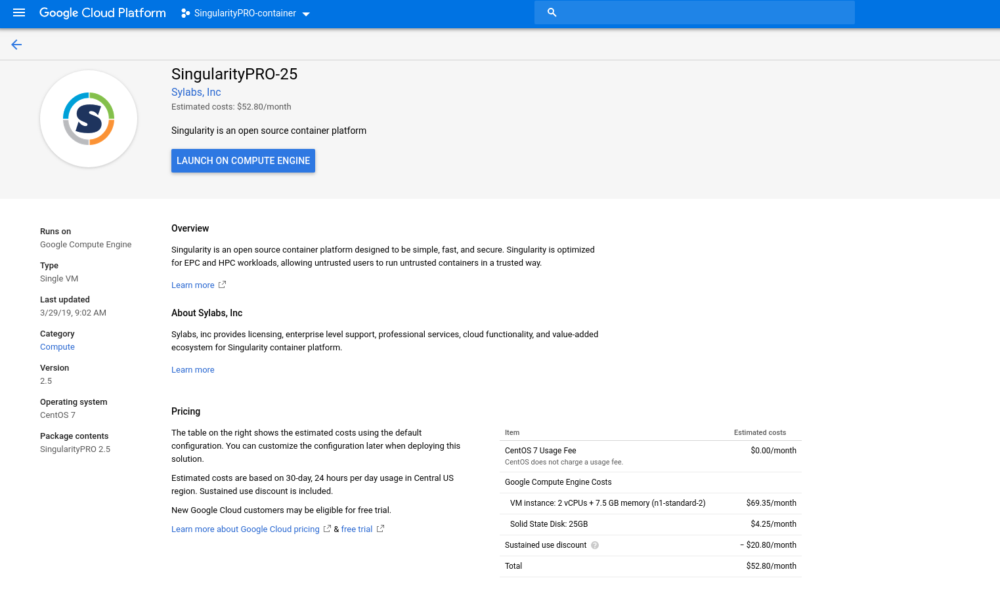
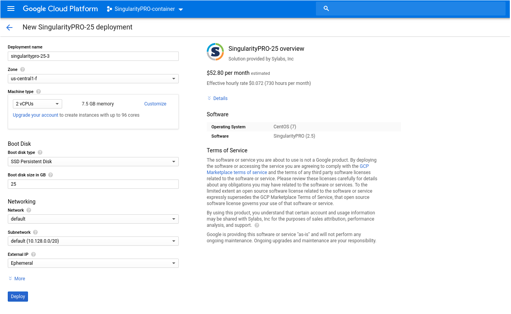
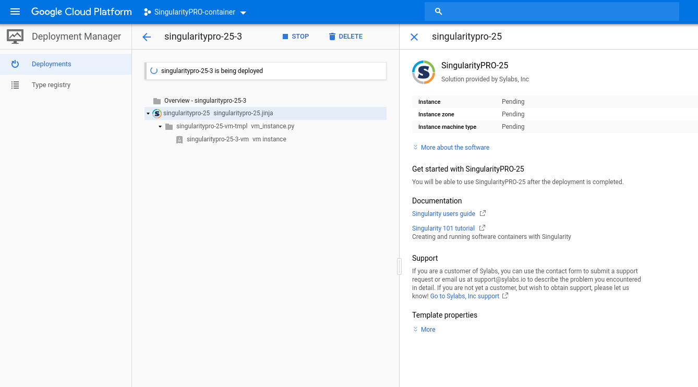
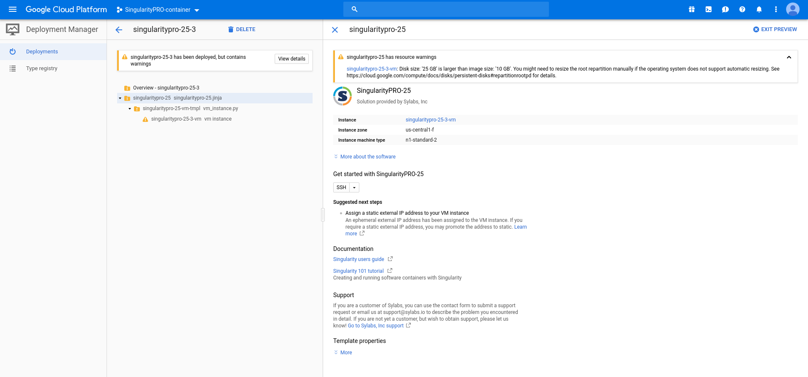
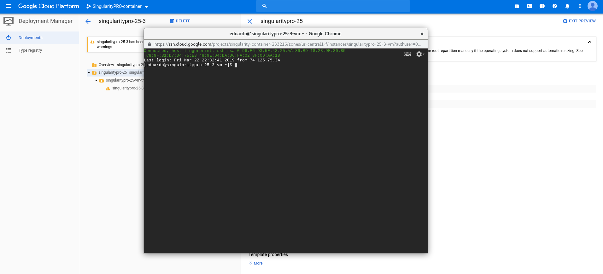
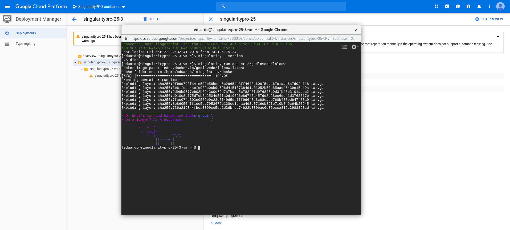

# Getting started guidelines
##  Running Singularity on GCP

### Via web GCP web platform
Select SingularityPRO-25 from the Google Cloud Launcher console and click Launch on Compute Engine

### Deploy SingularityPRO-25
1. Choose a name for your SingularityPRO-25 instance
2. Choose a machine type with at least 6GB of RAM; SingularityPRO-25 is charge free, you will only pay for the machine resource
3. Click Deploy

### Wait for it...

4. See it run! Save the Admin URL, user and password for the next steps.

5. Click on the SSH icon

We now have a running GCP instance with SingularityPRO-25 packed!

### check and start deploying your containers

